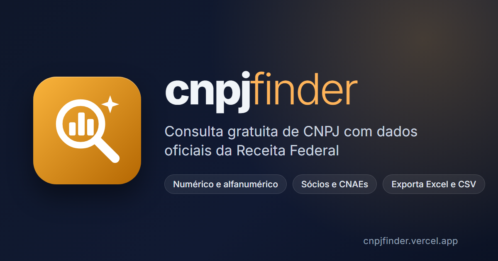

<p align="center">
  <a href="https://cnpjfinder.vercel.app">
    
  </a>
</p>

<p align="center">
  <strong>Consulta gratuita de CNPJ com dados públicos da Receita Federal.</strong><br>
  <a href="https://cnpjfinder.vercel.app">cnpjfinder.vercel.app</a>
</p>

---

## Sobre

O **cnpjfinder** é uma página web para consultar empresas brasileiras pelo CNPJ. Basta digitar ou colar o número, em qualquer formato, para ver razão social, situação cadastral, endereço, contatos, atividades (CNAEs), inscrições estaduais e sócios. As consultas podem ser exportadas para Excel, CSV ou JSON.

Não precisa de cadastro nem de login, e funciona no computador e no celular.

## Funcionalidades

- **CNPJ numérico e alfanumérico**: aceita o novo formato da Receita Federal (IN RFB nº 2.229/2024), vigente desde julho de 2026, por exemplo `12.ABC.345/01DE-35`.
- **Resumo da empresa** em destaque, com selos de situação cadastral (Ativa, Suspensa, Baixada, Inapta), Matriz/Filial, Simples Nacional/MEI e porte.
- **Dados completos** organizados por seção: informações básicas, empresa, endereço, contatos, atividades econômicas e inscrições estaduais.
- **Sócios e administradores**, com cargo, data de entrada e faixa etária.
- **Botão de copiar** em CNPJ, razão social, nome fantasia, endereço completo, CEP, código IBGE do município, telefones e e-mails.
- **Consultas recentes** na tela inicial: um clique refaz a consulta.
- **Exportação** das pesquisas salvas para **Excel (.xlsx)**, **CSV** (pronto para o Excel em português) e **JSON**.
- **Tema claro e escuro**, com a preferência salva no navegador.
- **Instalável como app** (PWA), com funcionamento básico offline.
- Botão **limpar** (×) no campo de busca, com atalho **Esc**.

## Como funciona

```
Navegador  ──►  /api/cnpj  (função serverless na Vercel)  ──►  API pública CNPJ.ws
   ▲                         │ valida o CNPJ
   │                         │ aplica limite de consultas
   └──── dados padronizados ◄┘ guarda em cache por 5 minutos
```

- **Front-end** (`public/`): HTML, CSS e JavaScript puros, sem framework e sem etapa de build.
- **Back-end** (`api/cnpj.js`): uma função serverless que valida o CNPJ, consulta a [API pública do CNPJ.ws](https://www.cnpj.ws/) e devolve os dados num formato único para a página.
- **Privacidade**: o histórico de consultas fica **apenas no navegador de quem consulta** (`localStorage`). Nada é gravado em servidor.

## API

A página usa um endpoint próprio, que também pode ser chamado diretamente.

```
GET /api/cnpj?cnpj=00.000.000/0001-91
```

O CNPJ pode ser enviado com ou sem pontuação, numérico ou alfanumérico.

**Resposta (200)** (resumida):

```json
{
  "error": false,
  "cached": false,
  "data": {
    "taxId": "00000000000191",
    "alias": "DIRECAO GERAL",
    "founded": "1966-08-01",
    "status": { "text": "Ativa" },
    "head": true,
    "company": {
      "name": "BANCO DO BRASIL SA",
      "nature": { "id": "2038", "text": "Sociedade de Economia Mista" },
      "size": { "text": "Demais", "acronym": "05" },
      "equity": 120000000000,
      "simples": { "optant": false },
      "simei": { "optant": false },
      "members": []
    },
    "address": {
      "street": "QUADRA SAUN QUADRA 5 BLOCO B TORRE I, II, III",
      "city": "Brasília",
      "state": "DF",
      "zip": "70040912",
      "municipality": "5300108"
    },
    "phones": [{ "area": "61", "number": "34939002", "type": "LANDLINE" }],
    "emails": [{ "address": "secex@bb.com.br", "ownership": "CORPORATE" }],
    "mainActivity": { "id": "6422100", "text": "Bancos múltiplos, com carteira comercial" },
    "sideActivities": [],
    "registrations": []
  }
}
```

**Erros**: todos no formato `{ "error": true, "message": "..." }`.

| Status | Quando |
|---|---|
| `400` | CNPJ não informado ou inválido (dígito verificador errado) |
| `404` | Empresa não encontrada |
| `408` | A consulta externa demorou demais |
| `429` | Limite de consultas atingido. O cabeçalho `Retry-After` informa quantos segundos esperar |
| `503` | Serviço externo indisponível |

**Limites**: até 10 consultas por minuto por IP e 3 por minuto para o mesmo CNPJ. A API pública usada como fonte também tem limites próprios.

## Rodando localmente

Requisitos: [Node.js](https://nodejs.org/) 18 ou superior e a [Vercel CLI](https://vercel.com/docs/cli).

```bash
git clone https://github.com/itsRomuloGarcia/CNPJFinder.git
cd CNPJFinder
npm install
npm install -g vercel
npm run dev
```

O `npm run dev` executa `vercel dev`. Na primeira vez, ele pede login na Vercel e para vincular o projeto. Depois, a página fica disponível em `http://localhost:3000`, já com a função `/api/cnpj`.

## Deploy

O projeto está hospedado na [Vercel](https://vercel.com/). Cada push na branch `main` gera um deploy automático.

Ao publicar uma versão nova, atualize `APP_VERSION` em `public/script.js` e `CACHE_NAME` em `public/sw.js`. Assim, quem já usa o site recebe o aviso de nova versão.

## Estrutura

```
├── api/
│   └── cnpj.js            # Função serverless: validação, limite, cache e consulta externa
├── public/
│   ├── index.html         # Página
│   ├── script.js          # Lógica do front-end (busca, exibição, exportação, histórico)
│   ├── style.css          # Estilos (temas claro e escuro, responsivo)
│   ├── sw.js              # Service worker (PWA e uso offline)
│   ├── logo.svg           # Logo / favicon
│   ├── og-image.png       # Imagem de compartilhamento (WhatsApp, LinkedIn...)
│   ├── icon-192.png       # Ícones do app instalado
│   ├── icon-512.png
│   └── manifest.json      # Manifesto do PWA
├── package.json
└── vercel.json            # Rotas e cabeçalhos da Vercel
```

## Fonte dos dados

As informações vêm dos **dados públicos do Cadastro Nacional da Pessoa Jurídica**, divulgados pela Receita Federal, consultados por meio da API pública do [CNPJ.ws](https://www.cnpj.ws/).

O cnpjfinder **não é um serviço oficial** da Receita Federal. Para fins legais, consulte sempre o [comprovante oficial de inscrição](https://solucoes.receita.fazenda.gov.br/servicos/cnpjreva/cnpjreva_solicitacao.asp).

## Autor

Desenvolvido por **Romulo Garcia**, com o apoio de IA.

[LinkedIn](https://linkedin.com/in/itsromulogarcia) · [GitHub](https://github.com/itsromulogarcia)
